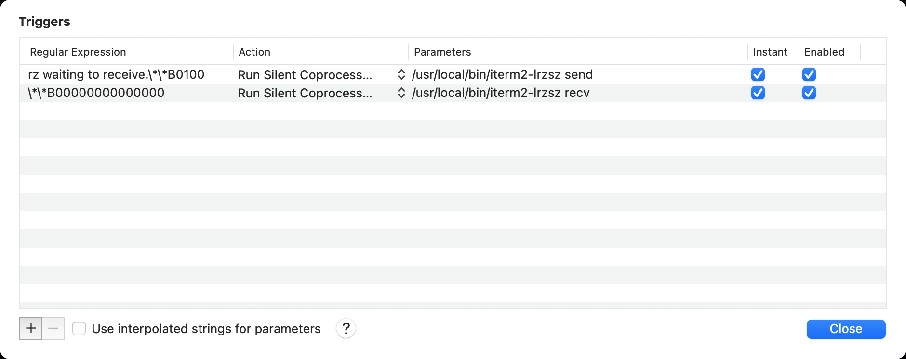
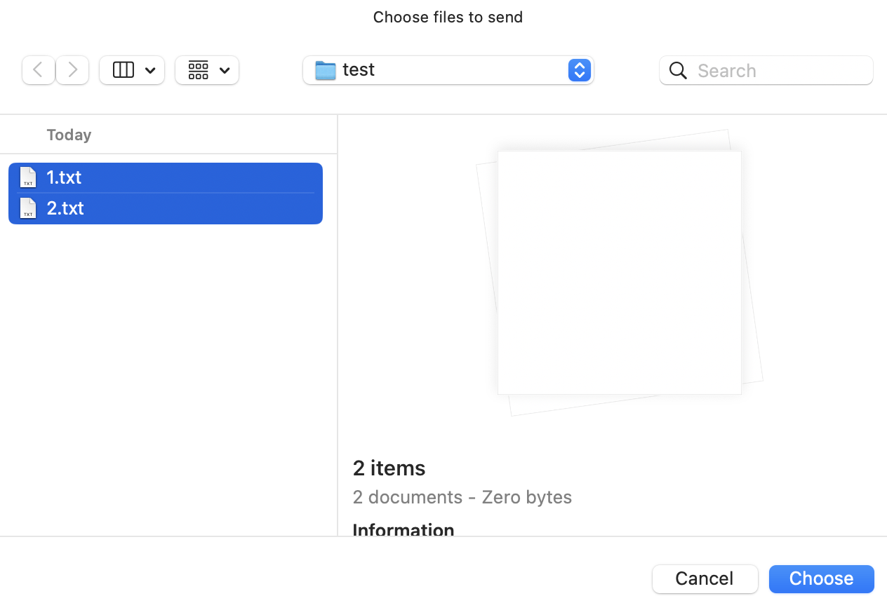

# iterm2-lrzsz

## Require
OS X version >= 10.10


## Features
- support to upload multiple files

## Usage
1. install lrzsz
```bash
brew install lrzsz
```
2. save this shell to somewhere, etc`/usr/local/bin`
```bash
sudo wget -qO /usr/local/bin/iterm2-lrzsz https://github.com/conorzhong/iterm2-lrzsz/raw/main/iterm2-lrzsz.sh
sudo chmod +x /usr/local/bin/iterm2-lrzsz
```
3. configure iterm2
    1. open: Preferences->Profiles->Advanced->Triggers->"+"(at bottom left)
    2. input: `rz waiting to receive.\*\*B0100`, `Run Silent Coprocess`, `/usr/local/bin/iterm2-lrzsz send`, check Instant and Enabled
    3. input: `\*\*B00000000000000`, `Run Silent Coprocess`, `/usr/local/bin/iterm2-lrzsz recv`, check Instant and Enabled
4. login your server(by iterm2)
5. run rz or sz

## Screenshots


